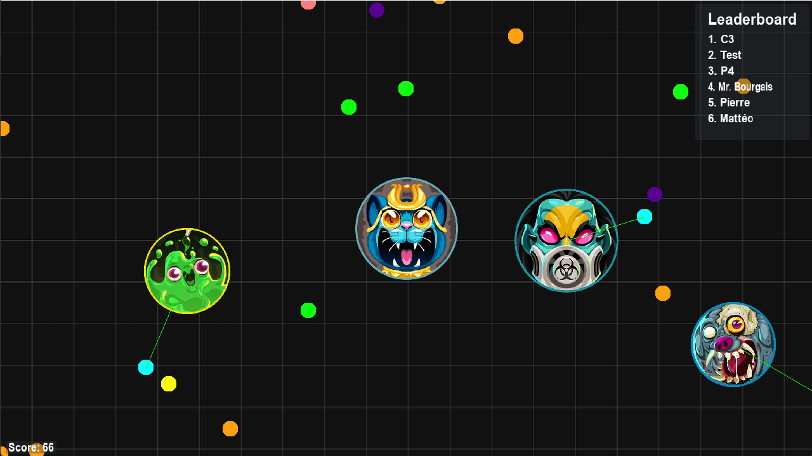

  

  <strong>Welcome to JYF.io. A remake of the famous game Agar.io in singleplayer mode using Pascal and SDL.</strong>

  

## Getting Started

First, install a Pascal compiler.

Next, fork the repository. Then, go into your favorite terminal.

    git clone git@github.com:YOUR_USERNAME/JYF.io.git
    cd agario

Now, while still inside the `JYF.io` folder, compile the project and click on the main.exe.

## Features

Here is a non-exhaustive list of the features of this game.

- [Player]
  - [x] Moving
- [User Interface]
  - [x] Leaderboard tab
  - [x] Death tab
  - [x] Start tab (nickname input) 
  - [x] Overall look &amp; feel
- [Ennemies]
  - [x] Spawning
  - [x] Attack and defense
  - [x] Intelligent movement
  - [x] KNN algorithm to feed itself
- Map
  - [x] Respawn system
  - [x] Border limits
  - [x] File-based generation 
  - [x] Game skills
    - [ ] Splitting
